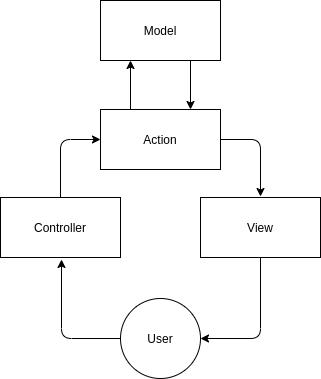

# Принципы работы
JS-MVCA фреймворк сильно отличается от прочих фреймворков выполняющих схожую задачу за счёт уникальной схемы разделения данных MVCA(Model View Constroller Action) специально созданного для этого фреймворка.

Основным способ комуникации клиента и сервера является [WebSockets](https://developer.mozilla.org/en-US/docs/Web/API/WebSockets_API), для удобства использования и поддержки большего количества устройств используется библиотека [socket.io](https://socket.io)

## MVCA
MVCA - это пересмотреная схема разделения данных [MVC](https://ru.wikipedia.org/wiki/Model-View-Controller) отличающиеся добавлением новой сущности __A - Action__.


Для ясности определем функцию каждого елемента цепи:
1. Model - необходим для представления данных
2. Action - служит в качестве интерфейса общения между клиентом и сервером, также на стороне сервера выполняет бизнес логику
3. View - представляет данные клиенту
4. Controller - выполняет логику на староне клиента и управляет View 

Таким образом фронтенд и бэкенд остаются __единым__ целом, при этом не теряя в __гибкости__

> В качестве примера предоставленно простейшее приложение TODO-списка, дальнейшшие примеры будут приводится отсюда

Расмотрим на премере:
1. При запуске приложения первое что видит польлзователь - это View отображение которого спровоцировал Controller
View представляет из себя скомпилированный шаблон (подробнее [здесь](frontend.md#view))
Пример: 
```html
<ul>
    {f:_this.items:item:
        {i:item.status == 'deleted':
            <li class="delete">{{item.text}}</li>
        :!}
    :!}
</ul>
```
2. Далее пользователь взаимодействует с Controller тем или иным способом.
Пример:
```html
<button class="deleteBtn" onclick="app.getController('exampleController').delete({{item.id}})">Delete</button>
```

3. При необходимости Controller может отправить запрос на сервер. Пример:
```javascript
delete(index) {
    this.app.socket.emit('delete', {
        id: index
    });
}
```

4. Запрос будет обработан соответсвующим Action. Пример:
```javascript
class deleteAction extends Action {
    request(data) {
       ...
    }
}
```
>До выполнения кода в теле метода request входные данные могут быть изменены при помощи Middleware. Так же возможно изменить данные непосредственно перед отправкой клиенту/клиентам 

5. Action может взаимодействовать с хранилищем данных посредством Model. Пример:
```javascript
todos
    .update({
        status: 'deleted'
    })
    .where('id', data.id)
    .execute();
```

Далее Action может вернуть какую-то информацию обратно клиенту, тот в свою очередь может изменить View основываясь на новых данных. Для примера можно рассмотреть функциональность удаления карточек из списка в файлах [View](../../client/views/example/item.html#L11), [Controller](./client/js/controllers/exampleController.js#L36), [Action](./server/actions/delete.js#L8) и [Model](./server/models/todos)
